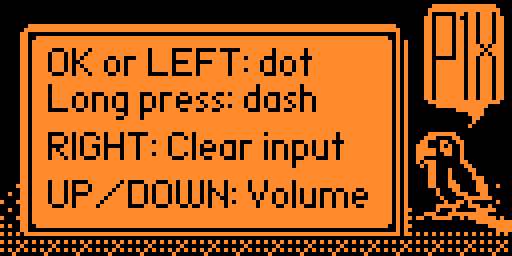

# Morse Master: Morse Code Learning Toolkit for Flipper Zero


A comprehensive Morse code learning and practice app for Flipper Zero. Final release of version 1.0.

## Overview

The Morse Master is an interactive application for Flipper Zero that helps you learn and practice Morse code. The app offers two main modes: a Learning Mode to familiarize yourself with Morse code patterns and a Practice Mode to test your skills.

## Features

### Learning Mode


- **Character Sets**: Switch between letters (A-Z) and numbers (0-9) with the LEFT/RIGHT buttons
- **Visual Representation**: See the Morse code pattern for each character
- **Audio Playback**: Hear the Morse code pattern played with clear and consistent timing
- **Navigation**: Cycle through characters with UP/DOWN buttons

### Practice Mode


- **Real-time Input**: Compose Morse code using short presses (dots) and long presses (dashes)
- **Live Decoding**: See your input decoded as you enter Morse code
- **Volume Control**: Adjust speaker volume with UP/DOWN buttons
- **Visual Feedback**: LED indicators change color based on input (red for dots, blue for dashes)


## Help




## Installation

### Method 1: Using qFlipper
1. Download the latest `.fap` file from the [releases page](https://github.com/w8death/morse-master/releases)
2. Open qFlipper and connect your Flipper Zero
3. Drag and drop the `.fap` file to the `Apps` folder on your Flipper Zero
4. Find the app in the `Apps` menu on your Flipper Zero

### Method 2: Using ufbt (for developers)
```bash
# Clone the repository
git clone https://github.com/w84death/morse-master.git

# Navigate to the project directory
cd morse-master

# Build and install the app
ufbt launch
```

## Usage

### Navigation
- Use UP/DOWN buttons to navigate menus and adjust values
- Use LEFT/RIGHT buttons to switch modes in Learning Mode
- Use OK button to select menu items or play sounds
- Use BACK button to return to previous screens

### Learning Mode Controls
- **OK**: Play the Morse code sound for the displayed character
- **UP/DOWN**: Navigate through characters
- **LEFT**: Switch to letters mode (A-Z)
- **RIGHT**: Switch to numbers mode (0-9)

### Practice Mode Controls
- **OK** (short press): Input a dot
- **OK** (long press): Input a dash
- **LEFT**: Add space
- **RIGHT**: Clear input
- **UP/DOWN**: Adjust volume

## Technical Details

- Written in C for the Flipper Zero platform
- Sound output via Flipper Zero's internal speaker
- Visual feedback via Flipper Zero's LED
- Low memory footprint: fits within Flipper Zero's limited resources

## License

This project is licensed under the MIT License - see the LICENSE file for details.

## Acknowledgments

- Thanks to the Flipper Zero community for their support and resources
- Inspired by classic Morse code training tools
